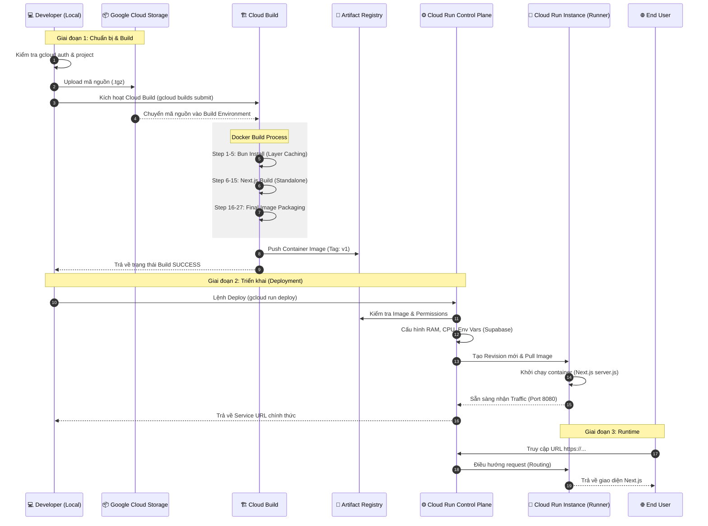

# Hướng dẫn triển khai Next.js (Bun) lên Cloud Run
Tài liệu tổng hợp quy trình đóng gói và triển khai dự án "Gia Phả OS" lên GCP.
## 1. Kiến trúc
- **Runtime**: Bun (Tối ưu tốc độ).
- **Build Engine**: Cloud Build (Build trên mây).
- **Registry**: Artifact Registry.
- **Hosting**: Cloud Run (Serverless).
---
## 2. Đóng gói (Dockerization)
File `next.config.ts` cần có:
```typescript
const nextConfig: NextConfig = {
  output: 'standalone',
};
```
### Dockerfile tối ưu
Sử dụng Multi-stage build để giảm dung lượng image:
1. **Stage 1 (deps)**: Cài đặt dependencies qua `bun.lock`.
2. **Stage 2 (builder)**: Biên dịch Next.js (nhận `ARG` chuyển thành `ENV`).
3. **Stage 3 (runner)**: Chứa file thực thi và static assets.
---
## Luồng triển khai chi tiết A-Z (Sequence Diagram)

---
## 3. Các lệnh CLI
### Bước 1: Build Image
```bash
gcloud builds submit --config cloudbuild.yaml \
--substitutions=_SUPABASE_URL="YOUR_URL",_SUPABASE_KEY="YOUR_KEY",_SITE_NAME="Ho_Pham" .
```
### Bước 2: Deploy Cloud Run
```bash
gcloud run deploy giapha-os \
--image asia-southeast1-docker.pkg.dev/[PROJECT_ID]/giapha-repo/giapha-os:v1 \
--region asia-southeast1 \
--allow-unauthenticated \
--set-env-vars SITE_NAME="Ho_Pham",NEXT_PUBLIC_SUPABASE_URL="...",NEXT_PUBLIC_SUPABASE_PUBLISHABLE_DEFAULT_KEY="..."
```
---
## 4. Lưu ý quan trọng
- **Build-time (NEXT_PUBLIC_*)**: Phải nhúng lúc build, nếu thiếu Client-side sẽ lỗi.
- **Run-time**: Dùng cho Server Components, cấu hình qua lệnh deploy hoặc UI.
- **Cloud Build**: Không cần cài Docker local, tốc độ build nhanh, tự động push image.
- **UI Console**: Quản lý Image tại Artifact Registry và Service tại Cloud Run.
---
## 5. Xử lý lỗi
- **Missing Supabase config**: Kiểm tra biến truyền vào `gcloud builds submit`.
- **.dockerignore**: Không ignore `bun.lock` và `package.json`.
- **Port**: Ứng dụng phải lắng nghe cổng 8080.
---
## 6. Hướng dẫn sử dụng Giao diện (Console UI)
Nếu bạn không muốn sử dụng CLI, Google Cloud Console cung cấp giao diện trực quan để quản lý:

### A. Quản lý Image (Artifact Registry)
1.  Tìm kiếm **"Artifact Registry"** trên thanh search.
2.  Vào repository `giapha-repo` -> `giapha-os`.
3.  Tại đây bạn sẽ thấy danh sách các phiên bản (Tags) đã build. Bạn có thể xóa các bản cũ để tiết kiệm chi phí lưu trữ.

### B. Triển khai Service (Cloud Run)
1.  Truy cập **Cloud Run**, nhấn **CREATE SERVICE**.
2.  **Chọn Image**: Nhấn nút "Select" và tìm đến image `v1` bạn vừa build.
3.  **Thiết lập tên & Vùng**: Đặt tên `giapha-os` và chọn `asia-southeast1`.
4.  **Cấu hình Ingress**: Chọn "Allow all traffic" và "Allow unauthenticated" để mở website ra internet.
5.  **Cấu hình Biến môi trường**:
    - Nhấn vào tab **Container(s)**.
    - Tại mục **Variables & Secrets**, thêm các biến `SITE_NAME`, `NEXT_PUBLIC_...` giống như trong file `.env`.
6.  **Tối ưu tài nguyên**: Bạn có thể chỉnh RAM (ví dụ: 512MB hoặc 1GB) và CPU tùy theo lượng người dùng.
7.  **Nhấn CREATE**: Đợi 30 giây để nhận URL.

### C. Theo dõi Logs & Giám sát
1.  Vào Service `giapha-os` đã tạo.
2.  Tab **LOGS**: Xem trực tiếp các lỗi ứng dụng (giống như `console.log` ở local).
3.  Tab **METRICS**: Xem biểu đồ về số lượng người truy cập, CPU và RAM đang sử dụng.

---
## 7. Hướng dẫn Build & Push Image qua UI (A-Z)
Trên GCP, việc "đưa image lên" bằng UI thực chất là thiết lập một **Cloud Build Trigger** để tự động build từ mã nguồn (GitHub/GitLab).

### Bước 1: Kết nối kho mã nguồn (Source Repository)
1.  Vào **Cloud Build** -> **Triggers**.
2.  Nhấn **MANAGE REPOSITORIES** -> **CONNECT REPOSITORY**.
3.  Chọn nguồn (ví dụ: **GitHub**). 
4.  Làm theo các bước đăng nhập và chọn repository `giapha-os` của bạn.

### Bước 2: Tạo Trigger (Bộ kích hoạt Build)
1.  Quay lại trang **Triggers**, nhấn **CREATE TRIGGER**.
2.  **Name**: `build-giapha-os`.
3.  **Event**: Chọn "Push to a branch" (mỗi khi bạn push code, nó sẽ tự build).
4.  **Source**: Chọn repository bạn vừa kết nối ở Bước 1.
5.  **Configuration**: Chọn **Cloud Build configuration file (yaml/json)**.
    - **Cloud Build configuration file location**: Nhập `cloudbuild.yaml` (nó sẽ đọc file này trong code của bạn).

### Bước 3: Cấu hình Biến môi trường (Substitutions)
Đây là phần thay thế cho lệnh `--substitutions` trong CLI:
1.  Kéo xuống mục **Advanced** -> **Substitutions**.
2.  Nhấn **ADD VARIABLE** và nhập các cặp:
    - `_SUPABASE_URL`: (Dán URL của bạn)
    - `_SUPABASE_KEY`: (Dán Key của bạn)
    - `_SITE_NAME`: `Ho_Pham`
    *(Lưu ý: Tên biến phải khớp chính xác với file cloudbuild.yaml)*.

### Bước 4: Chạy Build & Kiểm tra
1.  Sau khi tạo xong, nhấn nút **RUN** tại dòng Trigger vừa tạo.
2.  Chọn nhánh (branch) muốn build.
3.  Sang tab **Dashboard** hoặc **History** để xem quá trình build (hình bánh răng quay).
4.  Khi build xong, vào **Artifact Registry** bạn sẽ thấy một Image mới đã được đẩy lên tự động.

---
*Cập nhật: 26/04/2026*
